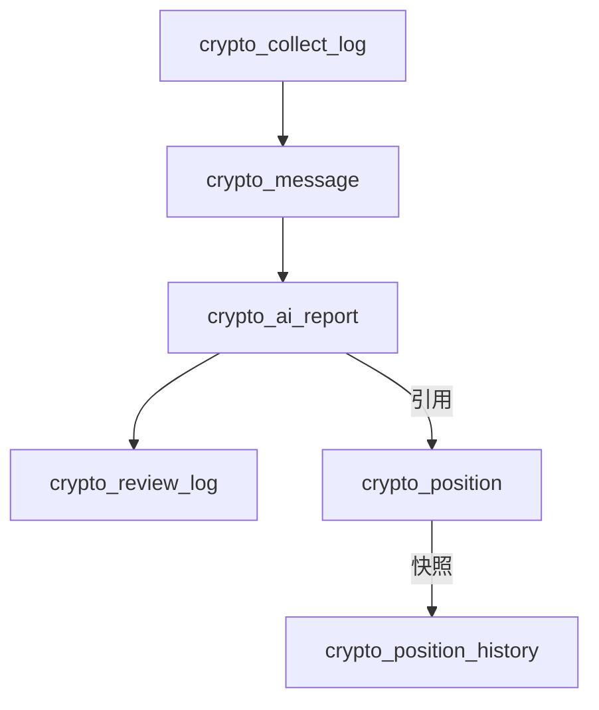

# 数据库结构分析

## 1. 整体架构

根据数据库脚本分析，AI驱动数字货币投资辅助系统的数据库包含6个核心表，形成了完整的数据流转和业务支持体系：

- **消息采集与分析流程**：`crypto_collect_log` → `crypto_message` → `crypto_ai_report` → `crypto_review_log`
- **持仓管理流程**：`crypto_position` ↔ `crypto_position_history`

## 2. 核心表结构分析

### 2.1 数字货币消息表 (crypto_message)

**主要功能**：存储采集的数字货币相关消息，包括原始信息和初步AI分析结果。

**关键字段**：
- `id`：消息主键ID
- `coin_type`：数字货币类型（BTC/ETH/SOL等）
- `title`、`content`：消息标题和内容
- `sentiment`：情感倾向（利好/利空/中性）
- `impact_level`：影响等级（1-5分）
- `analysis_result`：AI第一次分析结果
- `collect_time`：采集时间

**索引设计**：按币种、采集时间、情感倾向建立索引，优化查询性能。

### 2.2 当前持仓表 (crypto_position)

**主要功能**：存储用户最新的持仓数据，反映当前资产配置状态。

**关键字段**：
- `id`：记录主键ID
- `coin_type`：数字货币类型
- `amount`：持有数量
- `percentage`：占总资产比例
- `usd_value`：美元价值
- `price`：当前单价
- `snapshot_date`：快照日期

**约束设计**：使用唯一索引确保每种币种只有一条记录。

### 2.3 持仓历史表 (crypto_position_history)

**主要功能**：存储历史持仓快照，支持趋势分析和回测。

**关键字段**：
- `id`：记录主键ID
- `coin_type`：数字货币类型
- `amount`、`percentage`、`usd_value`、`price`：历史持仓数据
- `change_type`、`change_reason`：变动类型和原因
- `snapshot_date`：快照日期

### 2.4 AI分析报告表 (crypto_ai_report)

**主要功能**：存储基于消息和持仓的完整AI分析报告，包括两次分析结果和调整建议。

**关键字段**：
- `id`：报告主键ID
- `message_id`：关联消息ID（外键引用crypto_message）
- `first_analysis`：AI第一次分析结果
- `position_snapshot`：持仓快照（JSON格式）
- `second_analysis`：AI第二次分析结果
- `adjustment_suggestion`：调整建议（JSON格式）
- `report_status`：报告状态（待审核/已通过/已驳回）

### 2.5 审核日志表 (crypto_review_log)

**主要功能**：存储报告审核记录，跟踪人工干预过程。

**关键字段**：
- `id`：日志主键ID
- `report_id`：关联报告ID（外键引用crypto_ai_report）
- `reviewer_id`、`reviewer_name`：审核人信息
- `review_result`：审核结果（通过/驳回）
- `review_comment`：审核意见

### 2.6 消息采集日志表 (crypto_collect_log)

**主要功能**：存储定时任务的消息采集记录，用于监控系统运行状态。

**关键字段**：
- `id`：日志主键ID
- `task_date`：任务日期
- `collect_status`：采集状态（成功/失败）
- `message_count`：采集到的消息数量
- `duration`：执行耗时
- `error_msg`：错误信息

## 3. 表间关系

### 3.1 主要关联关系

### 3.2 外键约束

- `crypto_ai_report.message_id` → `crypto_message.id` (级联删除)
- `crypto_review_log.report_id` → `crypto_ai_report.id` (级联删除)

## 4. 业务流程分析

### 4.1 消息处理流程
1. **数据采集**：系统定时从外部源采集数字货币相关消息
2. **初步分析**：对每条消息进行情感分析和影响评估
3. **深度分析**：基于消息和当前持仓生成完整AI分析报告
4. **人工审核**：报告提交给人工审核，记录审核结果
5. **数据归档**：所有数据存入对应表，支持历史查询

### 4.2 持仓管理流程
1. **实时更新**：定期更新当前持仓数据
2. **历史记录**：保存持仓变动历史，支持趋势分析
3. **报告引用**：AI报告引用当前持仓作为分析基础

## 5. 前端实现考虑

### 5.1 数据访问需求
- **只读查询**：大部分场景下前端主要进行数据查询和展示
- **数据过滤**：按币种、时间、状态等条件筛选数据
- **分页加载**：处理大量历史数据时需要分页
- **实时更新**：部分关键数据需要实时刷新（如最新消息、持仓变化）

### 5.2 API设计方向
- **模块化路由**：按功能模块划分API路径
- **统一响应格式**：保持success、data、message的标准结构
- **扩展查询参数**：支持复杂的过滤和排序需求
- **批量操作**：支持批量获取相关数据，减少请求次数

### 5.3 Mock数据实现要点
- **完整性**：覆盖所有表的核心字段和关系
- **真实性**：生成符合业务逻辑的模拟数据
- **关联性**：确保Mock数据之间的引用关系正确
- **可扩展性**：支持后续功能扩展的数据需求